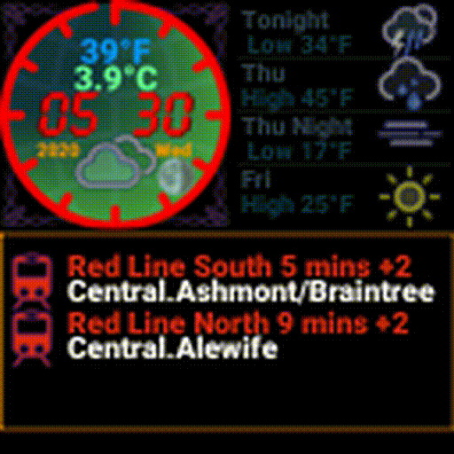
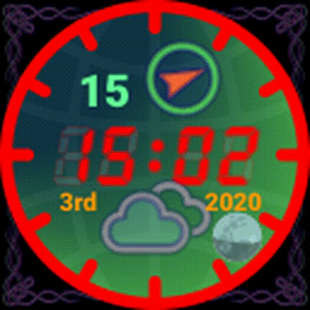

# Clock And Roll

The RGB Clock And Roll uses 1, 4, or 9 64x64 RGB panels from [Adafruit][ada]

Panels are driven using the phenominal [hzeller RGB Library] with a modified [Go binding]

The [Go binding] has been modified to expose the brightness capability.  The panel brightness is automatically adjusted at dawn and dusk.  More details on the binding modification to follow.

An [Adafruit HAT] or [Adafruit Bonnet] modified for PWM operation connect the RGB matrix panels to a Raspberry Pi

For the two panel mode a Pi Zero was capable but the 4 panel configuration needs a little more horespower and a Pi 3B+ is used

Initial development was done with only two panels and this simpler mode is still available via configuration

The display supports 2 panel mode, simple, 4 panel mode, full, and 9 panel mode, maxi, via configuration.

The initial build used python and SVG to paint the display.  As more features were added a rewrite in Golang aided performance.

Note the animation here is rather blocky, but the actual operation is buttery Rolex smooth
 

Weather data are obtained via the weathercache mechanism that is located in the scrollclock repo.  The weather icons come from the [Erik Flowers] SVG collection with some  programmatic modifications applied as they are rendered.  Full color icons have replaced the Flowers originals and configuration allows you to switch between the two.

When a track is playing details are displayed along with a rudementary VU meter, a more graphical VU is to be added in combination with a full multi-band visualization.

The meter is constructed by consuming streamed events from the piCorePlayer.  See my Vision On project for more details.

The news feed provides updates at configured intervals.  Multiple feeds may be specified but they should be RSS compliant or the results are unpredictable.

Minimal performance metrics may also be displayed.  These have been paticularly useful during the development of the coverart cache.

If a Logitech Media Server is configured details are displayed of the currently playing track inclusive of the cover art.  The coverart thumbnail is cached locally to minimize delays in rendering the display.  The cache is time-based and automatically purges to minimize local disk usage.

A VU and spectrum analyser display are also to be added; this will utilize a subscription based streamed event, SES, interface that runs locally on the [piCorePlayer].  Spectrum analyser and VU will only be shown in "maxi" mode utilizing 9 64x64 panels.

MBTA arrival predictions are also available.  Specify the required routes, stops and when the MBTA details should be displayed via configuration.

Moon phase is shown in the lower right corner of the display.  Phase updates in real time, the calculated phase is time dependent but does not include the observation locale.  Given the display fidelity the phase calculation and the resultant graphic are good to go!

And further home monitoring is to be added later, motion camera and ties to several Nest thermostats once Google has released the new API

Hopefully some or all of the code will find a use in your own projects

License
-------

MIT, see [LICENSE](LICENSE)

[ada]: https://www.adafruit.com/product/3649
[Adafruit Bonnet]: https://www.adafruit.com/product/3211
[Adafruit HAT]: https://www.adafruit.com/products/2345
[Go binding]: https://github.com/mcuadros/go-rpi-rgb-led-matrix
[hzeller RGB Library]: https://github.com/hzeller/rpi-rgb-led-matrix
[piCorePlayer]: https://www.picoreplayer.org/
[Erik Flowers]: https://github.com/erikflowers/weather-icons
