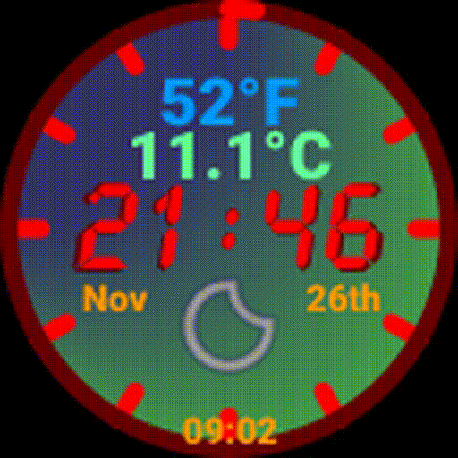

# Clock And Roll

The RGB Clock And Roll uses 4 64x64 RGB panels from [Adafruit][ada]

Panels are driven using the phenominal [hzeller RGB Library] with a modified [Go binding]

The [Go binding] has been modified to expose the brightness capability.  The panel brightness is adjusts at dawn and dusk.  More details on the modification to follow.

An [Adafruit HAT] or [Adafruit Bonnet] modified for PWM operation connect the RGB matrix panels to a Raspberry Pi

For the two panel mode a Pi Zero was capable but the 4 panel configuration needs a little more horespower and a Pi 3B+ is used

Initial development was done with only two panels and this simpler mode is still available via configuration

The initial build used python and SVG to paint the display.  As more features were added a rewrite in Go helped with performance.

Note the animation here is rather blocky, but the actual operation is buttery Rolex smooth
 

Weather data are obtained via the weathercache mechanism that is located in the scrollclock repo.  The weather icons come from the [Erik Flowers] SVG collection with some  programmatic modifications applied as they are rendered.

The news feed is not fully functional as yet, skeleton code is in place but needs vertical scrolling to be implemented before its activated.

And further home monitoring is to be added later, motion camera and ties to several Nest thermostats

Hopefully some or all of the code will find a use in your own projects

License
-------

MIT, see [LICENSE](LICENSE)

[ada]: https://www.adafruit.com/product/3649
[Adafruit Bonnet]: https://www.adafruit.com/product/3211
[Adafruit HAT]: https://www.adafruit.com/products/2345
[Go binding]: https://github.com/mcuadros/go-rpi-rgb-led-matrix
[hzeller RGB Library]: https://github.com/hzeller/rpi-rgb-led-matrix
[Erik Flowers]: https://github.com/erikflowers/weather-icons
